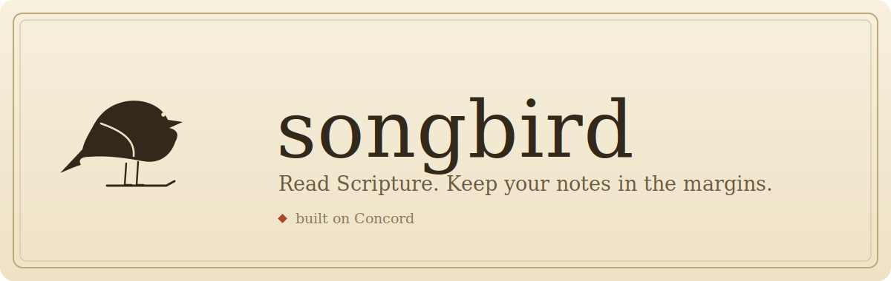
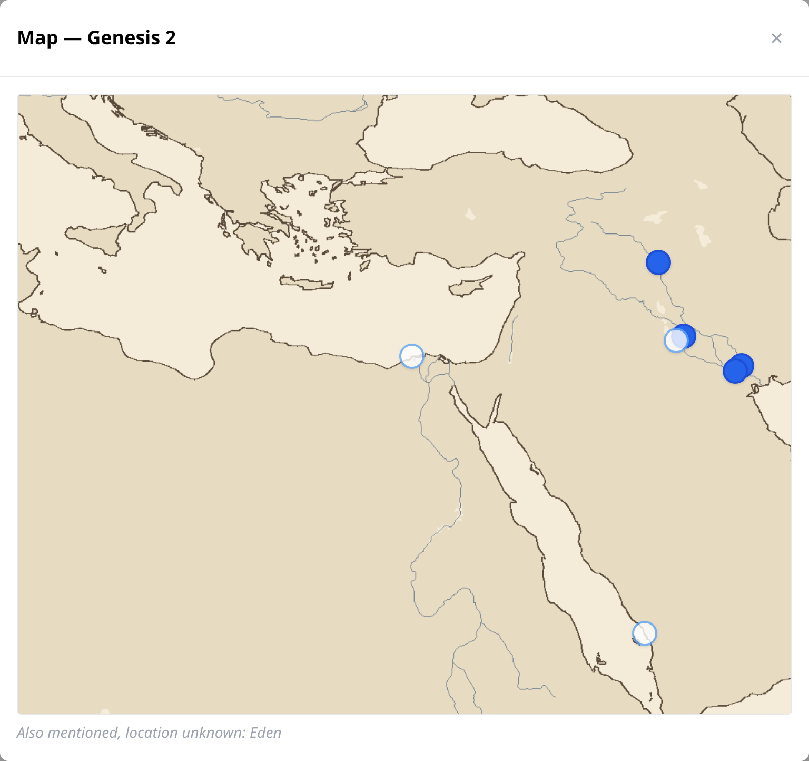

<p align="center">
  
</p>

<p align="center"><i>A quiet place to read Scripture and keep your own notes in the margins — running on your own computer.</i></p>

---

songbird lets you **read the Bible, highlight a verse, and write a note behind it** — like marking up a study Bible, but yours, private, and on your own machine. Switch between translations and your notes stay put. Tag them, search them, see a passage’s places on a map, and follow the cross-references behind each verse.

It’s **self-hosted**: it runs on your computer, your notes never leave it, and it works without an internet connection once it’s set up.

<br>

## See it

**Read and annotate.** Click a verse, write a note in the side panel, and it’s saved — right there in the margin.


**Search by meaning.** Ask for “verses about anxiety” and find the right passages — even ones that don’t contain the word.


**See it on a map.** A passage’s places pinned on a Bible-world map — honest about the ones it can’t place.



<br>

## What you’ll need

Just two things:

- **A computer** (Windows, Mac, or Linux).
- **Docker Desktop** — a free program that runs apps like songbird. [Download it here](https://www.docker.com/products/docker-desktop/) and install it like any other app, then open it once so it’s running.

That’s it. About **15 minutes** the first time. You don’t need to know how to code.

<details>
<summary>New to Docker? Here’s the one-minute version.</summary>

<br>

Docker is a free tool that runs a program and everything it needs in a tidy, self-contained bundle — so you don’t have to install a pile of technical pieces by hand. You install Docker Desktop once, open it (you’ll see a little whale icon when it’s running), and then songbird starts with a single command. You can quit Docker Desktop anytime to stop everything.
</details>

<br>

## Get it running

**1. Download songbird.** Click the green **`Code`** button near the top of this page, then **Download ZIP**. Unzip it somewhere easy to find, like your Desktop.

<details>
<summary>Prefer the command line? Use git instead.</summary>

<br>

```bash
git clone https://github.com/kbennett2000/songbird.git
```
</details>

**2. Open a terminal in the songbird folder.**

<details>
<summary>How do I open a terminal in a folder?</summary>

<br>

- **Windows:** open the unzipped `songbird` folder, click the address bar at the top, type `cmd`, and press Enter.
- **Mac:** right-click the `songbird` folder → *Services* → *New Terminal at Folder*. (Or open Terminal and type `cd `, drag the folder onto the window, press Enter.)
- **Linux:** right-click inside the folder → *Open Terminal Here*, or `cd` into it.
</details>

**3. Start it with one command:**

```bash
docker compose up
```

The first time, this downloads the Scripture engine and builds songbird. **It takes a few minutes — that’s completely normal.** You’ll see a lot of text scroll by; you don’t need to read it. Wait until it settles down and stops scrolling.

> ☕ The first run is the slow one. Every time after this, it starts in seconds.

**4. Open songbird in your browser:** go to **[http://localhost:8077](http://localhost:8077)**

**5. Create your account.** The first person to sign up is the owner. Pick a username and password — they stay on your computer.

**6. Start reading.** Open a chapter, click a verse, and write your first note. You’re in. 🎉

<details>
<summary>When you’re done — how to stop songbird.</summary>

<br>

In the terminal, press **Ctrl + C**, then run `docker compose down`. Your notes are saved and will be waiting next time. To start it again later, just run `docker compose up` from the songbird folder.
</details>

<br>

## Using songbird

- **Write a note** — click any verse number; a notepad opens beside it. Notes can have **bold**, *italics*, links, and lists.
- **Switch translations** — pick a different translation up top; your notes stay anchored to the right verses. A note you wrote in one translation is gently marked when you read another.
- **Tag and find** — add tags to a note, then use the **browse** view to find notes by tag, or **search** to find Scripture by meaning.
- **Go deeper** — hover a verse for its **cross-references**, or tap the **globe** to see a passage’s places on a map, when their locations are known.

<br>

## How it works (for the curious)

songbird is the app you use. The Scripture itself — the text, the search, the places — comes from **[Concord](https://github.com/kbennett2000/concord)**, a companion Scripture engine that runs alongside songbird. The single command above starts both for you. songbird keeps only *your* notes; Concord provides the Bible. If you’re technically inclined, [the design notes are here](docs/v1/SPEC.md), and the **map view** (added in v1.1) is described [here](docs/v1.1/MAP-SPEC.md).

<br>

## Trouble?

<details>
<summary>“docker: command not found” or nothing happens</summary>

<br>

Docker Desktop isn’t running. Open it (look for the whale icon), wait until it says it’s running, then try `docker compose up` again from the songbird folder.
</details>

<details>
<summary>The page won’t load at localhost:8077</summary>

<br>

Give it a moment — on the first run, songbird waits for the Scripture engine to be ready before it starts. If the terminal is still scrolling, it’s not finished yet. Once the text settles, refresh the page. If another program is using port 8077, stop it (or ask in [Issues](../../issues) and we’ll help).
</details>

<details>
<summary>It says it can’t reach Concord</summary>

<br>

songbird needs its Scripture engine running. If you started everything with `docker compose up` from the songbird folder, both run together automatically. If you see this error, the engine may still be starting (wait a moment and refresh) or may have been stopped — restart with `docker compose up`.
</details>

<br>

## License

songbird is open source under the [MIT License](LICENSE). Use it, share it, make it yours.

<p align="center"><sub>Read Scripture. Mark what speaks to you. Keep your notes in the margins.</sub></p>
