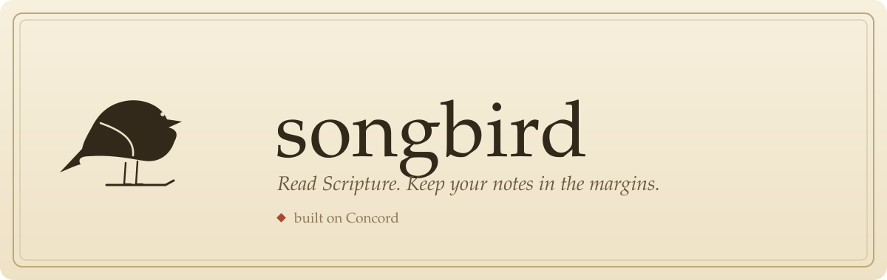
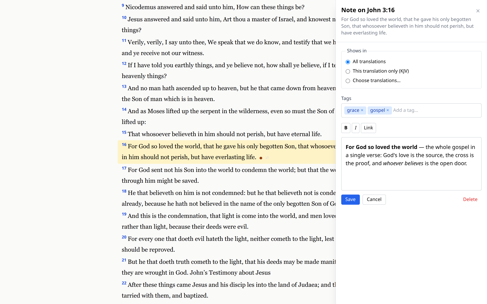
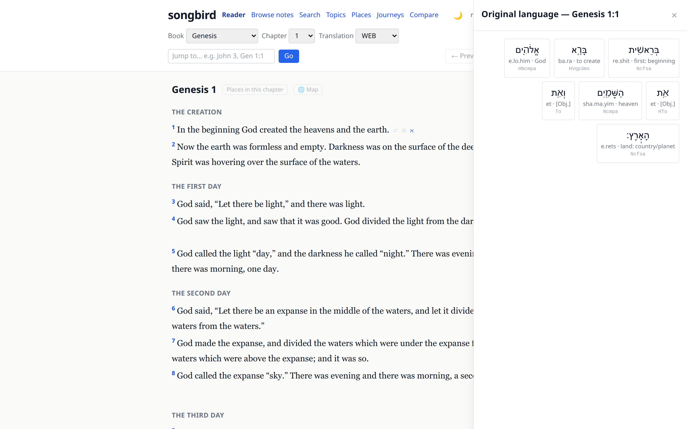
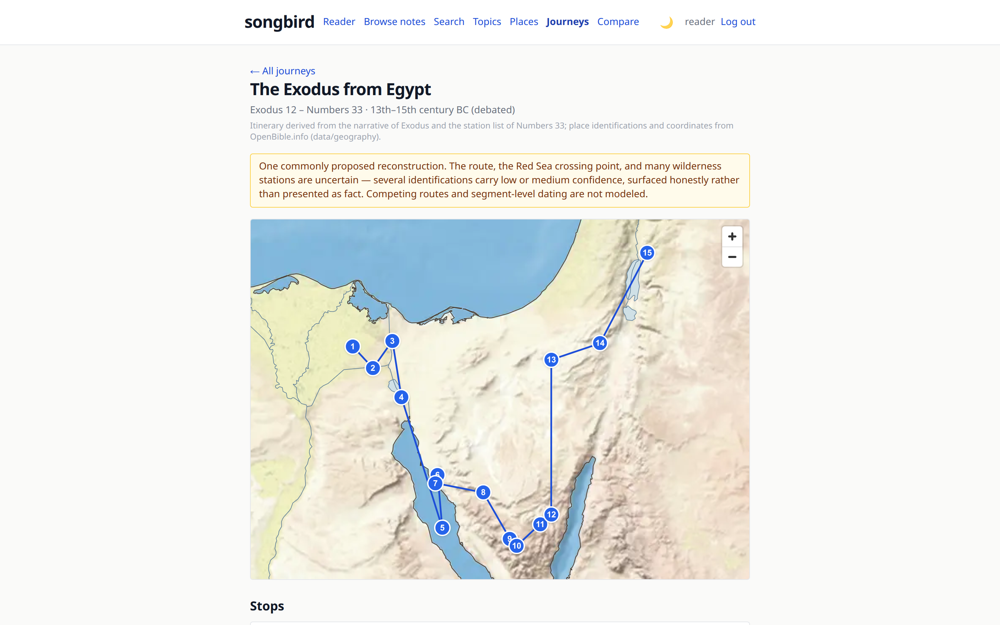
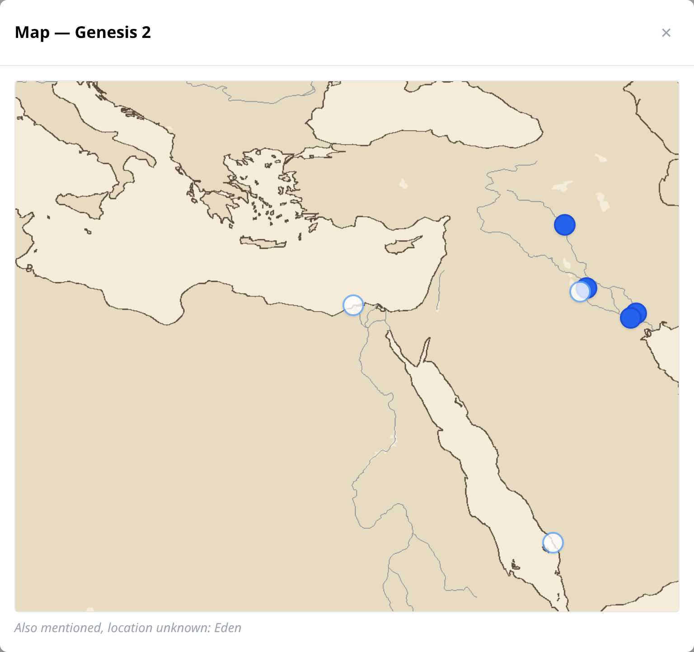
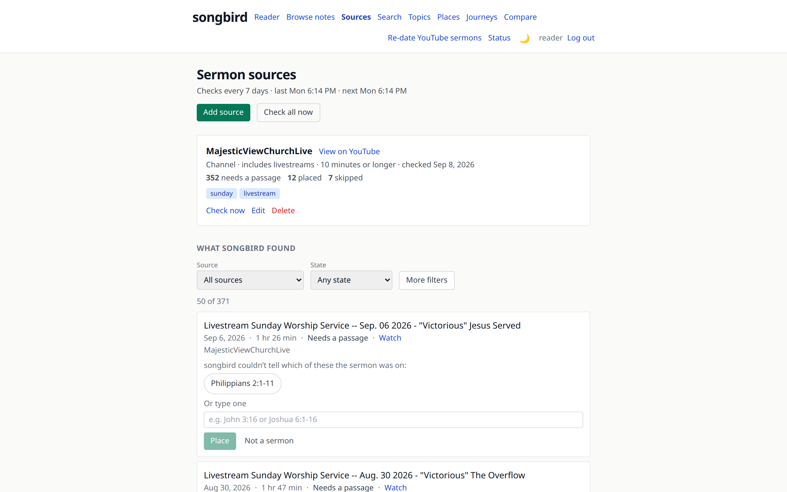

<p align="center">
  
</p>

<p align="center"><i>A quiet place to read Scripture and keep your own notes in the margins — running on your own computer.</i></p>

---

songbird lets you **read the Bible, highlight a verse, and write a note behind it** — like marking up a study Bible, but yours, private, and on your own machine. Switch between translations and your notes stay put. Tag them, search them, link a sermon to a passage, see a passage’s places on a map, and follow the cross-references behind each verse.

It’s **self-hosted**: it runs on your computer, your notes never leave it, and it works without an internet connection once it’s set up.

The Bible text, search, and maps come from **[Concord](https://github.com/kbennett2000/concord)** — a companion Scripture engine that songbird is built on and runs alongside. The one command below starts both for you; songbird keeps only *your* notes, Concord provides the Scripture.

<br>

## See it

**Read and annotate.** Click a verse, write a note in the side panel, and it’s saved — right there in the margin.



**Study the words behind the words.** Open any verse in its original Hebrew or Greek, then tap a word for its meaning and every place it appears.



**Follow a journey.** Trace the Exodus or Paul’s travels stop by stop on the map — each stop tied to the passage it comes from.



**See it on a map.** A passage’s places pinned on a Bible-world map — honest about the ones it can’t place.



**Let your church’s YouTube channel write your sermon notes.** Follow a channel once and songbird reads each sermon for the passage it names, then notes it for you — and hands you the ones it couldn’t work out, a tap each.



<br>

## What you’ll need

Just two things:

- **A computer** (Windows, Mac, or Linux).
- **Docker Desktop** — a free program that runs apps like songbird. [Download it here](https://www.docker.com/products/docker-desktop/) and install it like any other app, then open it once so it’s running.

That’s it. About **15 minutes** the first time. You don’t need to know how to code.

<details>
<summary>New to Docker? Here’s the one-minute version.</summary>

<br>

Docker is a free tool that runs a program and everything it needs in a tidy, self-contained bundle — so you don’t have to install a pile of technical pieces by hand. You install Docker Desktop once, open it (you’ll see a little whale icon when it’s running), and then songbird starts with a single command. You can quit Docker Desktop anytime to stop everything.
</details>

<br>

## Get it running

**1. Download songbird.** Click the green **`Code`** button near the top of this page, then **Download ZIP**. Unzip it somewhere easy to find, like your Desktop.

<details>
<summary>Prefer the command line? Use git instead.</summary>

<br>

```bash
git clone https://github.com/kbennett2000/songbird.git
```
</details>

**2. Open a terminal in the songbird folder.**

<details>
<summary>How do I open a terminal in a folder?</summary>

<br>

- **Windows:** open the unzipped `songbird` folder, click the address bar at the top, type `cmd`, and press Enter.
- **Mac:** right-click the `songbird` folder → *Services* → *New Terminal at Folder*. (Or open Terminal and type `cd `, drag the folder onto the window, press Enter.)
- **Linux:** right-click inside the folder → *Open Terminal Here*, or `cd` into it.
</details>

**3. Start it with one command:**

```bash
docker compose --profile bundled-concord up
```

The first time, this downloads the Scripture engine and builds songbird. **It takes a few minutes — that’s completely normal.** You’ll see a lot of text scroll by; you don’t need to read it. Wait until it settles down and stops scrolling.

> ☕ The first run is the slow one. Every time after this, it starts in seconds.

**4. Open songbird in your browser:** go to **[http://localhost:8077](http://localhost:8077)**

**5. Create your account.** The first person to sign up is the owner. Pick a username and password — they stay on your computer. Anyone else you share the computer with can make their own account too, and each person’s notes are private to them.

**6. Start reading.** You’ll land on a home page that greets you and — once you’ve read a little — offers to pick up where you left off. Open a chapter, click a verse, and write your first note. You’re in. 🎉

**New here?** The **[User’s Guide](docs/USER-GUIDE.md)** walks through every feature — reading and annotating, search, the study tools, places and journeys, and comparing translations — each with a screenshot.

<details>
<summary>When you’re done — how to stop songbird.</summary>

<br>

In the terminal, press **Ctrl + C**, then run `docker compose down`. Your notes are saved and will be waiting next time. To start it again later, run the same command from step 3 in the songbird folder.
</details>

<br>

## How it works (for the curious)

songbird is the app you use; **[Concord](https://github.com/kbennett2000/concord)** is the Scripture engine it’s built on — the text, the search, the places, and the cross-references all come from Concord over the network, and the single command above starts both for you. songbird keeps only *your* notes; Concord provides the Bible.

Because the Scripture comes from Concord, **the translations you get are whichever ones your Concord carries.** The one that comes with songbird carries the public-domain translations — the KJV, the ASV, the WEB, the Berean Standard Bible and a dozen more. That’s what a public download is allowed to include; translations like the ESV or the NKJV are licensed, so no public download can ship them.

That `--profile bundled-concord` in the start command is what asks for the included engine. Already running your own Concord — on this machine or anywhere on your network? Then you don’t need it. Point songbird at yours instead: make a file called `.env` next to `docker-compose.yml` with one line naming its address:

```bash
CONCORD_BASE_URL=http://192.168.1.62:8000
```

Then start songbird by itself, leaving the flag off:

```bash
docker compose up
```

Whatever translations your Concord serves are the ones songbird will show.

Either way, the app’s **Status** page names the exact Concord it is reading and lists every translation it found there.

That same `.env` file is where the rest of songbird’s settings live, and there are only a few. To let songbird follow a church’s YouTube channel you give it a free key from Google — the [User’s Guide walks you through getting one](docs/USER-GUIDE.md#following-a-churchs-youtube-channel), and without one that feature is simply switched off:

```bash
YOUTUBE_API_KEY=AIza...your key here...
SERMON_CHECK_INTERVAL_HOURS=168
SERMON_MIN_MINUTES=10
```

The second line is how often songbird looks for new sermons, in hours — 168 is once a week, and `0` means it only ever looks when you ask. The third is the shortest video it will treat as a sermon, which is what keeps clips and trailers out of your notes. Both have sensible defaults, so you only need the first. Treat the key like a password: it stays in `.env`, which is never committed.

- **Want to use it?** Every feature, walked through with screenshots, is in the **[User’s Guide](docs/USER-GUIDE.md)**.
- **Want to see how it’s built?** Start with [the design notes](docs/v1/SPEC.md), then the per-feature specs under [`docs/`](docs/).

Want to build something like this yourself? The Concord ecosystem now has two beginner courses: **[concord-tutorial-web](https://github.com/kbennett2000/concord-tutorial-web)** builds your first Concord app in plain HTML and JavaScript, and **[concord-tutorial-react](https://github.com/kbennett2000/concord-tutorial-react)** picks up from there and walks you — one idea at a time — right up to reading songbird’s own source.

<br>

## Trouble?

<details>
<summary>“docker: command not found” or nothing happens</summary>

<br>

Docker Desktop isn’t running. Open it (look for the whale icon), wait until it says it’s running, then run the command from step 3 again in the songbird folder.
</details>

<details>
<summary>The page won’t load at localhost:8077</summary>

<br>

Give it a moment — on the first run, songbird waits for the Scripture engine to be ready before it starts. If the terminal is still scrolling, it’s not finished yet. Once the text settles, refresh the page.

If another program on your computer is already using port 8077, songbird can’t start there — but you don’t have to stop the other program. Open the `.env` file next to `docker-compose.yml` (make one if there isn’t one yet), add a line reading `PORT=8078`, and start songbird again with the command from step 3. It’ll be at [http://localhost:8078](http://localhost:8078) instead. Still stuck? Ask in [Issues](../../issues) and we’ll help.
</details>

<details>
<summary>A translation I expect isn’t in the list</summary>

<br>

Open the **Status** page in songbird. It names the Concord it’s reading and lists every translation that Concord carries — and that list is everything songbird can offer.

If the one you want isn’t there, it isn’t missing from songbird; it isn’t in that Concord. The engine that ships with songbird carries the public-domain translations only. To read others, point songbird at a Concord that has them by setting `CONCORD_BASE_URL` in your `.env` file (see *How it works* above), then start it again.
</details>

<details>
<summary>It says it can’t reach Concord</summary>

<br>

songbird needs its Scripture engine running. If you started everything with the command from step 3, both run together automatically. If you see this error, the engine may still be starting (wait a moment and refresh) or may have been stopped — start it again with that same command.

The **Status** page in songbird shows the exact address it’s trying, which is the quickest way to see what it’s looking for.
</details>

<br>

## License

songbird is open source under the [MIT License](LICENSE). Use it, share it, make it yours.

<p align="center"><sub>Read Scripture. Mark what speaks to you. Keep your notes in the margins.</sub></p>
