# The songbird guide

This guide picks up the moment songbird is running and you've signed in. (If you haven't gotten it
running yet, the [README's "Get it running"](../README.md#get-it-running) walks you through that
first — it takes about fifteen minutes and no coding.) From here on, we'll move through songbird the
way you'll actually use it: reading, writing notes, and finding them again.

## What's inside

1. [Getting started in the app](#getting-started-in-the-app) — your account, the home page, picking
   up where you left off
2. [Reading](#reading) — moving around the Bible, switching translations, headings and notes, light
   or dark
3. [Annotating](#annotating) — writing a note, tagging it, linking a sermon to a passage
4. [Study tools](#study-tools)
5. [Finding things](#finding-things)
6. [Exploring places and journeys](#exploring-places-and-journeys)
7. [Comparing translations](#comparing-translations)
8. [Your data](#your-data)

 

## Getting started in the app

This is what you see every time you open songbird:

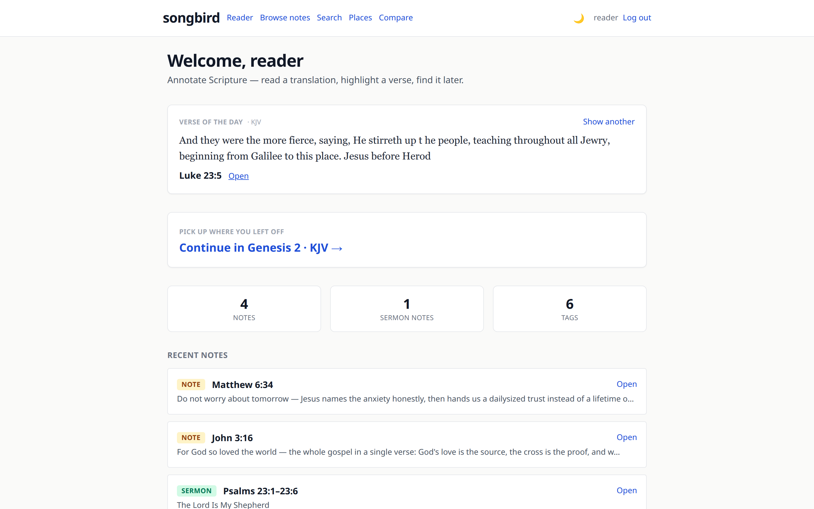

It greets you by name and gives you a few ways back into Scripture.

**Your account is yours.** The first person to sign up on a fresh songbird is the owner. If you share
the computer, anyone else can make their own account too — and **each person's notes are completely
private to them.** Nobody sees yours; you don't see theirs. Signing in is just the username and
password you picked.

**The verse of the day** sits at the top in your reading translation — a passage to greet you. Click
**Open** to read it in full, or **Show another** if you'd like a different one.

**Pick up where you left off.** Once you've done a little reading, a *"Continue in …"* link appears
(here it's *Continue in Genesis 2*) and drops you back exactly where you were — same book, same
chapter, same translation.

Below that, a quiet tally of how many **notes**, **sermon notes**, and **tags** you've collected, and
a list of your **recent notes** — each one a link straight back to the verse it sits on. The more you
read and write, the more these fill in. This home page becomes *yours*.

 

## Reading

Open a book and you're reading. Here's John chapter 3:

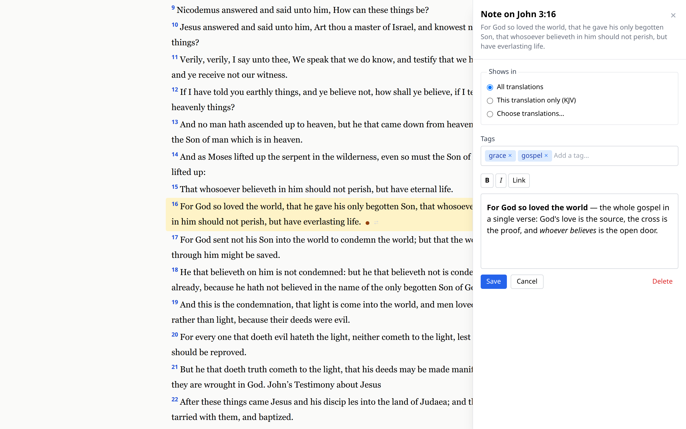

That's the whole idea of songbird in one picture — Scripture on the left, and a note you wrote
tucked into the margin on the right.

**Getting around.** Up top, the **Book** and **Chapter** dropdowns take you anywhere; **← Prev** and
**Next →** walk you one chapter at a time. In a hurry? The **Jump to…** box understands plain
references — type something like `John 3` or `Gen 1:1` and press **Go**.

**Switching translations.** A *translation* is one English wording of the Bible — songbird offers
several (WEB, KJV, and more). Pick a different one from the **Translation** dropdown and the text
re-renders in that wording. Here's the thing that makes songbird songbird: **your notes stay anchored
to the verse, not the wording.** A note you wrote on John 3:16 shows up on John 3:16 in *every*
translation. And if a note you wrote while reading one translation turns up while you're reading
another, songbird marks it gently, so you always know where it came from.

**Section headings.** Some translations include the little editor's headings that group a passage —
like *Jesus and Nicodemus* over John 3 in the picture above. When a translation has them, they appear
right in the text, no setting to flip.

**Those small numbers in the verse.** A few Scripture engines also carry the translators' own
footnotes. If you ever see **small raised numbers** sprinkled through the text, like this —

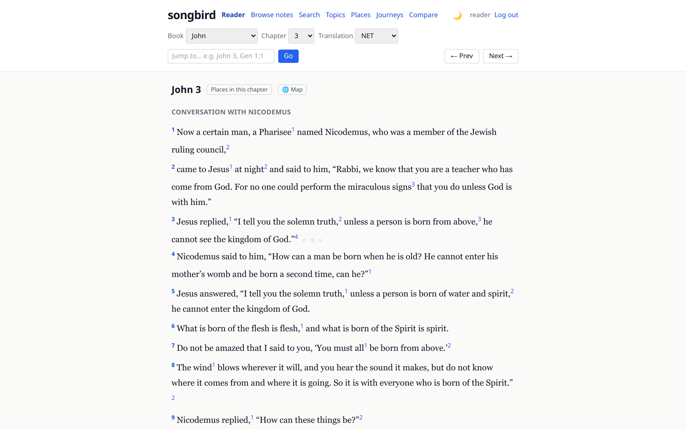

— those are translator's notes, and tapping one opens the translators' comment on that word or
phrase. **The standard songbird setup includes none of these,** so most readers won't see them at all
— there's nothing missing if your text is clean.

**Light or dark.** The little sun/moon toggle in the top corner switches between a light theme and a
dark one — easy on the eyes in a dim room — and songbird remembers which you prefer:

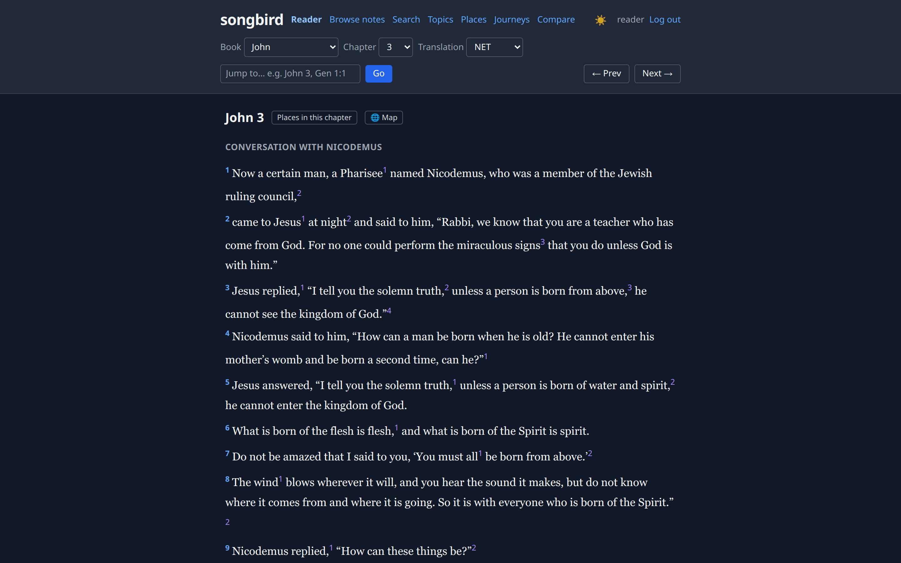

That's reading. Everything else in songbird hangs off of it.

 

## Annotating

Reading is half of songbird. The other half is writing in the margins. **Click any verse number and
a notepad opens beside it** — write, and it's saved the moment you do:

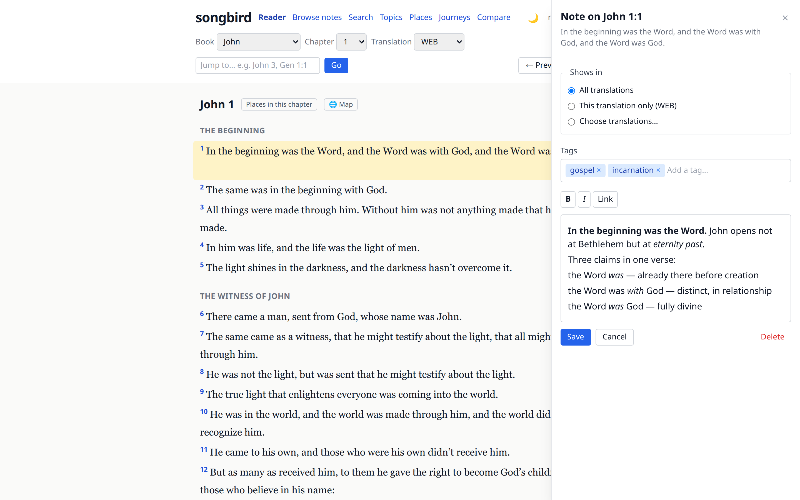

**Writing a note.** The notepad takes *rich text* — formatting like you'd use in a document. The
**B**, **I**, and **Link** controls give you **bold**, *italics*, and links, and you can build
bulleted lists, just like the note on John 1:1 above. Your notes are yours and private.

**Tags.** A *tag* is a short label you stick on a note — *gospel*, *incarnation*, *comfort*, whatever
helps. Add a few and later you can round up every note that shares one (that's coming up in
[Finding things](#finding-things)).

**Linking a sermon.** songbird can also pin a **sermon** — a talk you watched or preached — to the
passage it's about. A small **▶** appears in the margin of those verses; tap it and the sermon's
details open: its title, date, any tags, and a **link to watch**:

Because the note is anchored to the verse, that **▶** shows up no matter which translation you're
reading. And when a passage has gathered **more than one** sermon, the marker shows a count — **▶ 2**
— and tapping it opens a little chooser so you can pick which one to open:

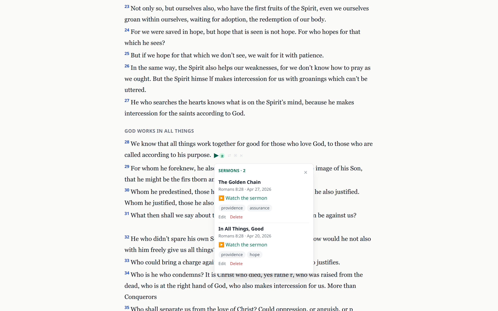

That's the heart of songbird: read a verse, mark what speaks to you, and find it again later.

 

## Study tools

There's a quiet layer of study help tucked into every verse. **Hover your mouse over a verse and a
small row of faint icons appears just after it** — each one opens a panel about *that* verse:

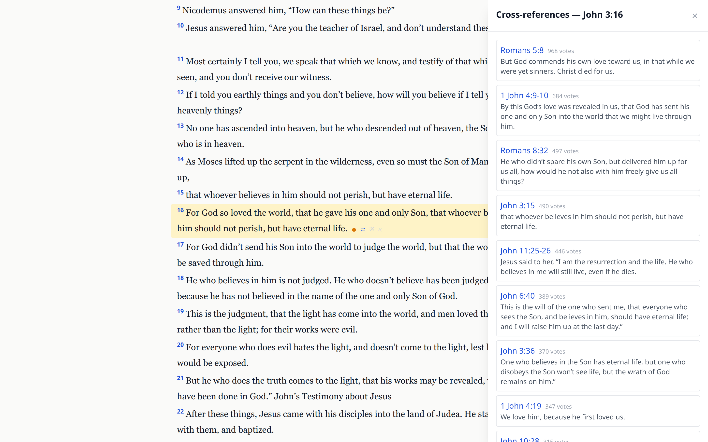

You don't have to memorize the icons; each one shows its name when you point at it. Here's what they
do.

**Cross-references (⇄).** A *cross-reference* is another passage that speaks to the one you're reading
— a promise echoed, a prophecy fulfilled, the same idea somewhere else. The **⇄** panel lists them
for the verse (above, the references behind John 3:16), each with a snippet so you can see what it
says; **tap one to jump straight there.**

**Topics (※).** The **※** panel shows the themes a verse sits under — the big ideas it belongs to:

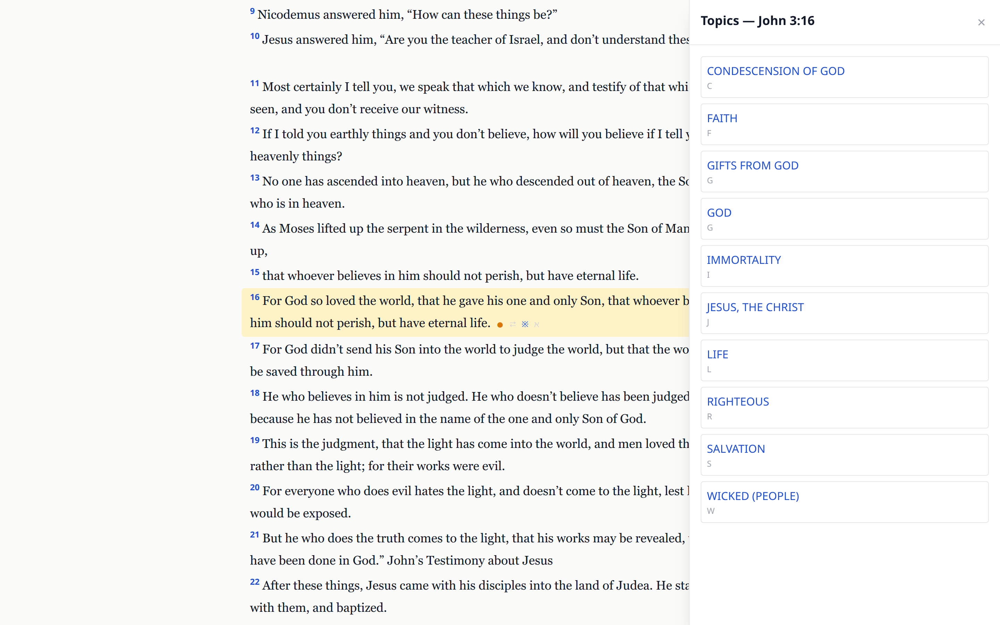

**Tap a topic to follow it.** songbird opens that theme and lists every verse gathered under it, each
one jump-able, with a *← Topics* link to step back:

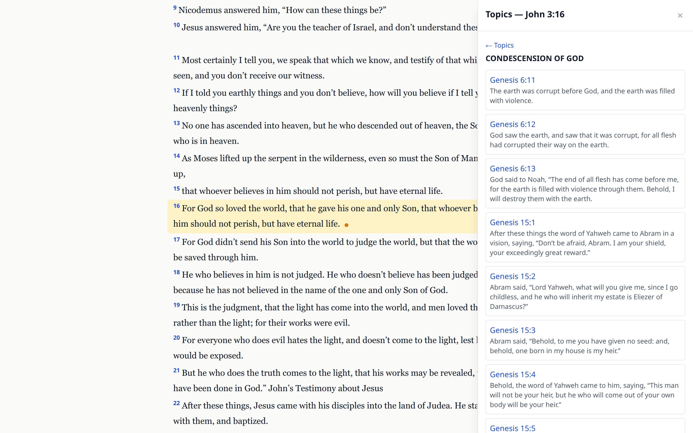

It's a way to read *across* Scripture by idea, not just straight through.

**Original language (ℵ).** The **ℵ** panel opens the verse in the language it was first written —
Hebrew in the Old Testament, Greek in the New — word by word:

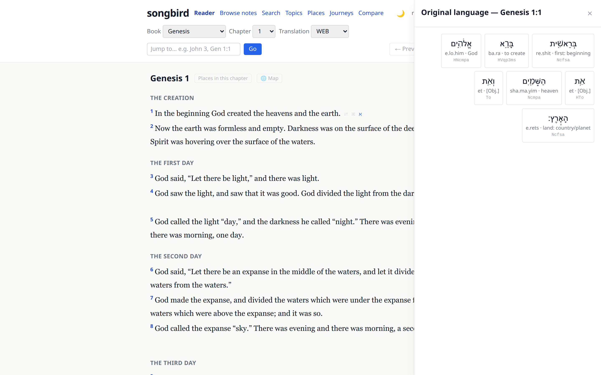

Each card is one original word with how it's pronounced and what it means. Hebrew reads **right to
left**, so the cards run that way too, matching the order of the Hebrew text. **This is the
*original-language* words behind the verse** — it isn't a tap-an-English-word tool; it shows you what
stands under the translation.

**Tap a word** and songbird opens its dictionary entry and a **concordance** — every other place in
Scripture that same original word appears:

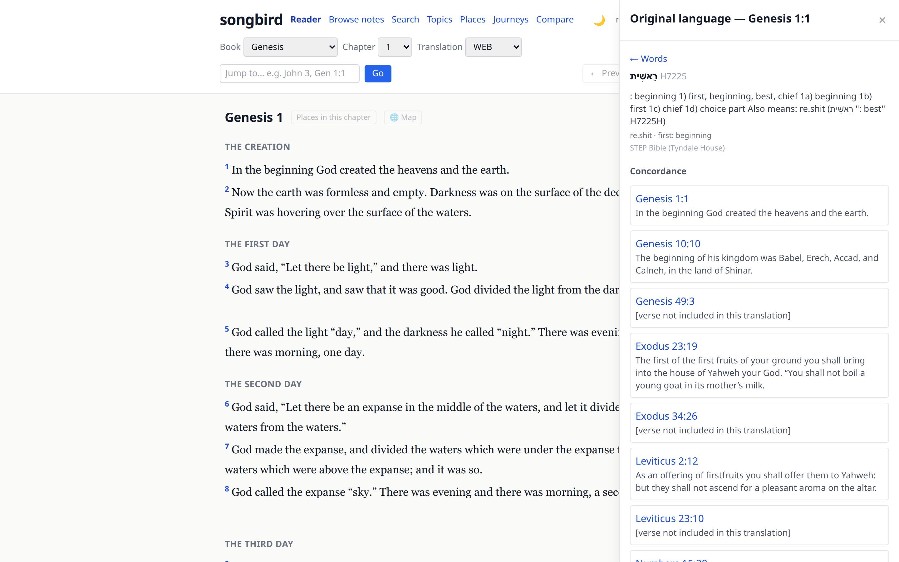

(Where a verse in the concordance isn't carried by your current translation, songbird says so plainly
rather than leaving a gap.)

**Places in this chapter.** One more study button lives at the top of every chapter, next to its
title: **Places in this chapter** lists the locations named in what you're reading —

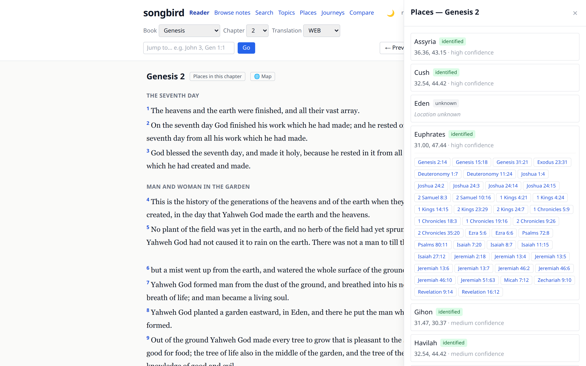

— a quick peek at the geography right where you're reading. Seeing those places **on a map**, and
wandering the full atlas of biblical locations, gets its own section:
[Exploring places and journeys](#exploring-places-and-journeys).

 

## Finding things

A note you wrote last year, a verse whose words you half-remember, every passage about a theme — songbird
is built to hand them back.

**Search Scripture two ways.** Open **Search** up top. You can search **by meaning** — ask in plain
words and songbird finds the passages that *mean* that, even when they don't contain your word:

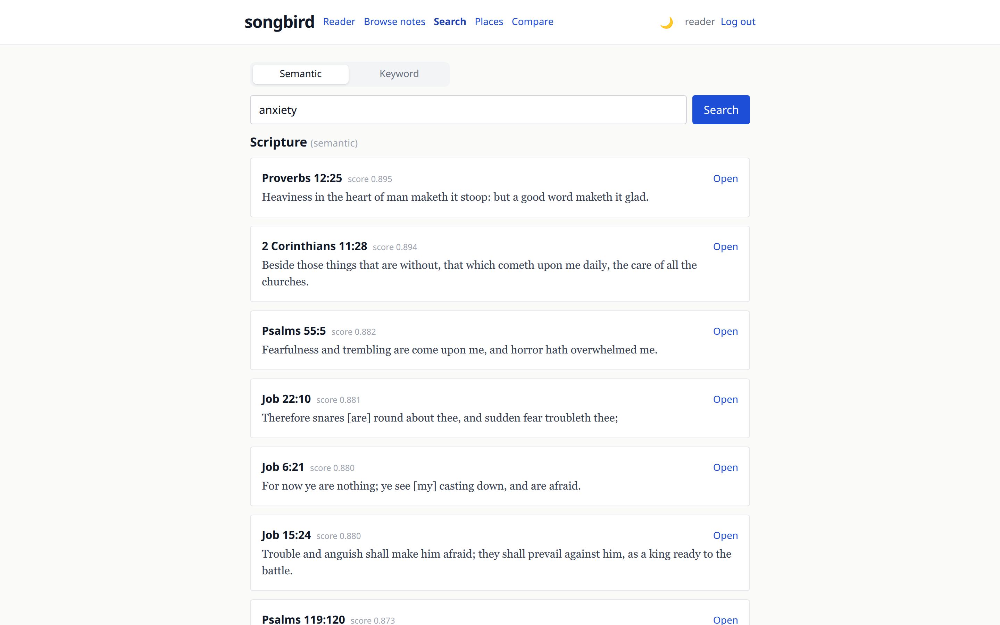

That's the **Semantic** tab ("semantic" just means *by meaning*); each result shows how closely it
matches. Or flip to the **Keyword** tab to find an **exact word or phrase** — and a keyword search can
sweep **every translation at once, or just the ones you pick**, highlighting each hit so you can see how
each wording lands:

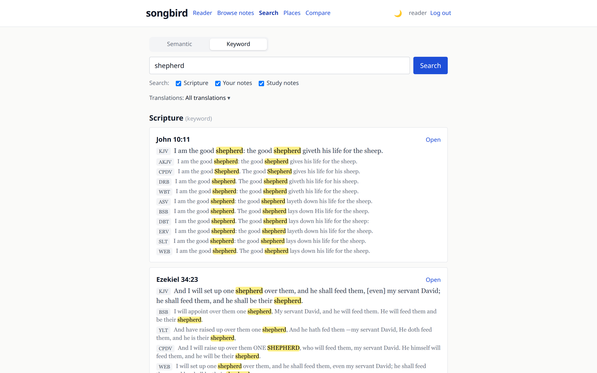

Notice the row of checkboxes under the search box: the same search can also look through **your own
notes** and through **study notes** — the translators' footnotes from [Reading](#reading). Study notes
are **only there when your Scripture engine provides them** (the standard setup ships none), so that
option simply stays quiet until it has something to find.

**Find your own notes.** Two ways, depending on what you remember. If you recall a *word* you wrote,
search for it with **Your notes** ticked in that same checkbox row:

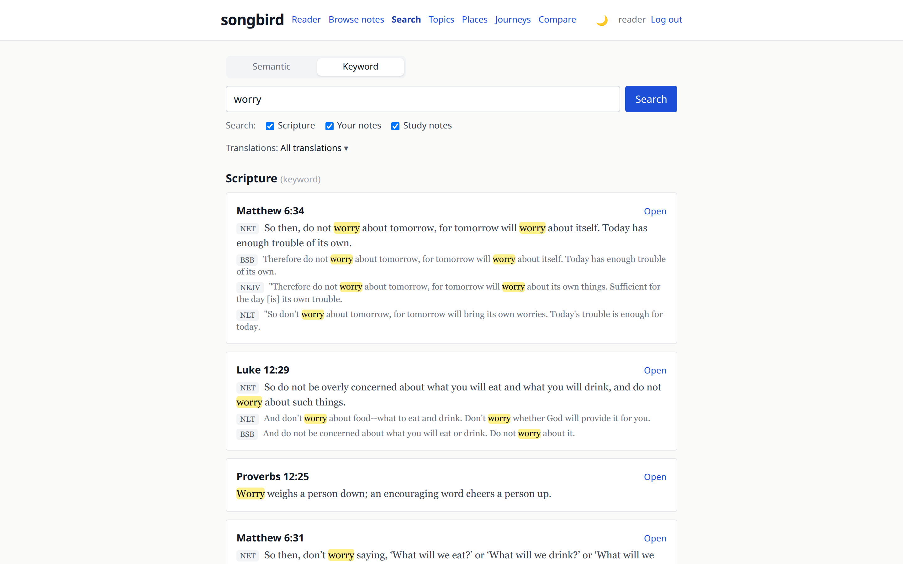

If you recall the *tag* instead, open **Browse notes** and **filter by tag** — tap a label and songbird
rounds up every note wearing it:

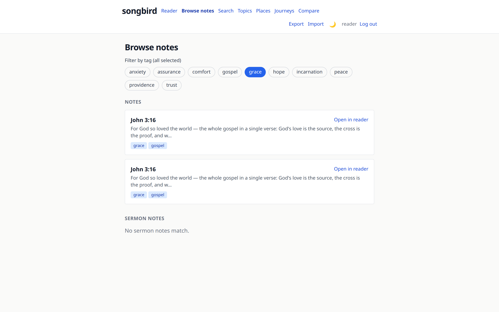

**Back up your notes.** See **Export** and **Import** in the corner of Browse notes? **Export** writes
all your notes and sermons to a single file you can keep or move; **Import** loads that file on another
computer, **skipping anything you already have** so nothing doubles up. Your notes are yours — portable,
and never locked inside one machine.

## Exploring places and journeys

The "Places in this chapter" peek from [Study tools](#study-tools) has a fuller home here. songbird
gives you two ways to wander the world the Bible happens in: **every place** named in it, and a set
of **journeys** you can trace stop by stop.

**Every place, in one list.** Open **Places** up top for the *gazetteer* — a browsable index of every
location Scripture names:

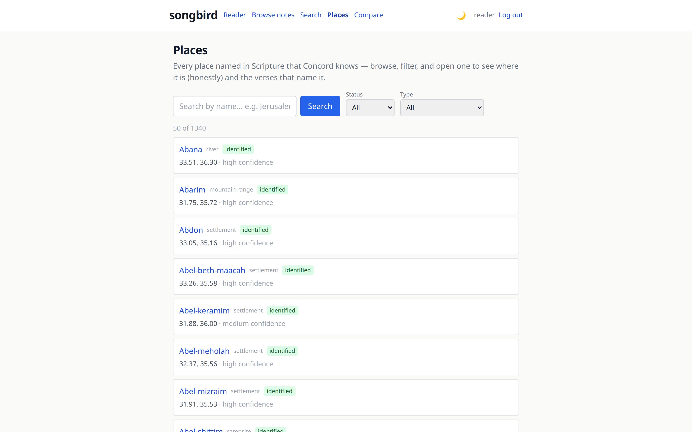

That's more than thirteen hundred of them. **Search by name**, or narrow the list with the **Status**
filter (how sure we are of where it sat) and the **Type** filter (river, settlement, region,
mountain…). Each row tells you what kind of place it is, its coordinates, and — honestly — how
confident that location is.

**Open a place to see it up close.** Tap any name for its own page: what it is, its modern name if it
has one, the honest confidence in its location, and **every verse that mentions it** — each one a
jump straight back into the reader:

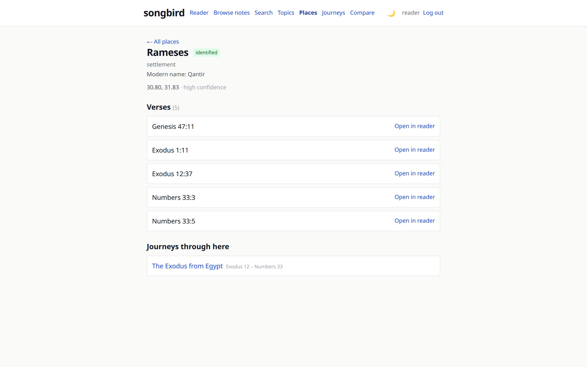

And notice the **"Journeys through here"** section at the bottom — Rameses, it turns out, is a stop on
*The Exodus from Egypt*. That's the second way to explore.

**Follow a journey.** Open **Journeys** for the curated set — the Exodus, Paul's missionary travels,
his voyage to Rome — each listed with its passage, rough dating, and how many stops it has:

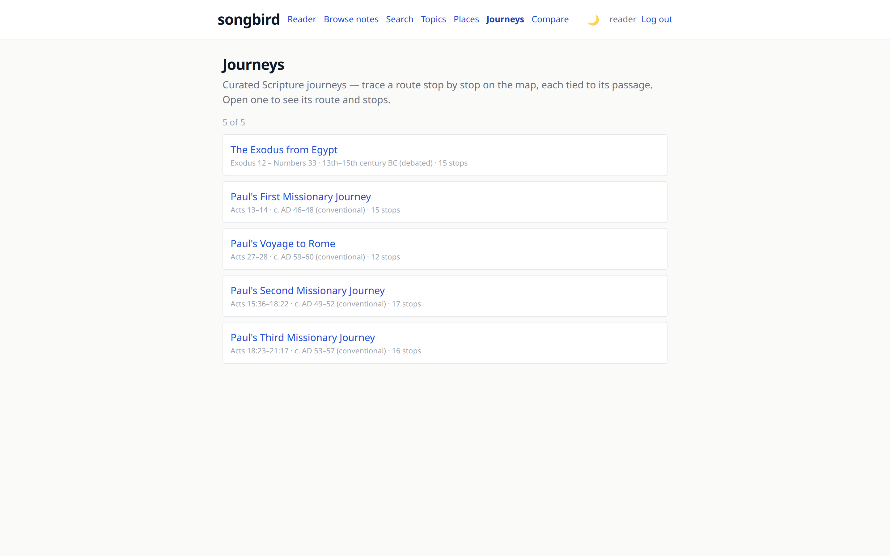

Open one and songbird draws its **route on a map with numbered stops**, followed by a **Stops** list
in order — each stop tied to the passage it comes from, ready to jump to:

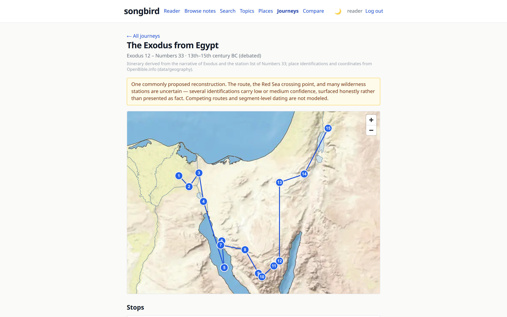

**One honest caveat, shown right above the map.** A journey like the Exodus is **one scholarly
reconstruction, not a GPS track.** The route, the Red Sea crossing point, and many wilderness stops
are genuinely uncertain — some carry low or medium confidence, and songbird says so plainly rather
than pretending otherwise. Competing routes and fine-grained dating aren't drawn at all. And a stop
whose location nobody knows is still **listed in order — just marked "Location unknown" and left off
the map** rather than pinned to a guess. You're seeing a careful best-reading of the text, with its
seams left honest.

 

## Comparing translations

Sometimes the clearest way to understand a verse is to set wordings side by side. Open **Compare**:

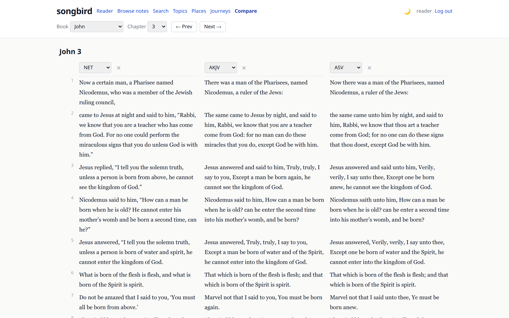

You can read **up to three translations at once**, each in its own column, **lined up verse for
verse** — so verse 3 in one column sits right beside verse 3 in the others. Pick the translation at
the top of each column; the Book, Chapter, and **← Prev / Next →** controls work just like the
reader. Any **notes you've written show up in the column they belong to** (here they're read-only —
Compare is for reading across, not editing).

It's the quickest cure for a puzzling phrase: a line that reads stiffly in one translation often comes
clear the moment you see how another renders it.

 

## Your data

That's the whole of songbird. A few things worth keeping in mind as you go.

**Your notes are yours.** Each account's notes are private to the person who wrote them — nobody else
who uses this songbird can see yours (see [Getting started](#getting-started-in-the-app)).

**They're portable.** You're never locked in: the **Export** and **Import** buttons in Browse notes
save all your notes and sermons to a single file and load them on another computer — the walkthrough
is back in [Finding things](#finding-things).

**Read however suits the room.** The light/dark toggle is always in the top corner, and songbird
remembers your choice (more in [Reading](#reading)).

That's everything. Open a chapter, click a verse, and write the first thing that speaks to you — the
rest of songbird is just here to help you find it again. 🕊️
